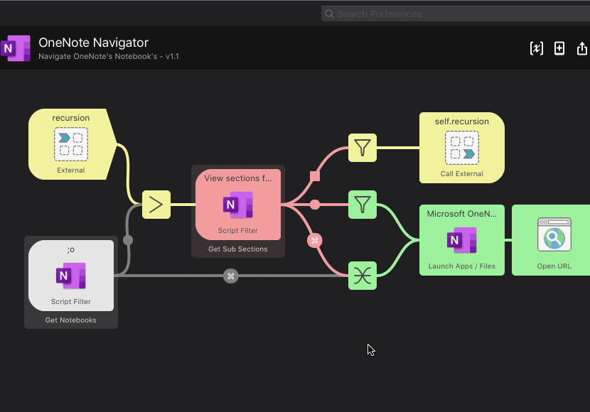

Navigate OneNote Notebooks With Alfred
===============================

Browse and open your Microsoft OneNote notebooks from [Alfred 3][alfredapp].

<!-- MarkdownTOC autolink="true" bracket="round" depth="3" autoanchor="true" -->

- [Features](#features)
- [Installation](#installation)
- [Usage](#usage)
- [Licensing & thanks](#licensing--thanks)
- [Changelog](#changelog)

<!-- /MarkdownTOC -->

Features
--------

- Browse all OneNote Notebooks and sections/section groups
- Press ↩︎ to continue diving deeper into notebook hierarchy. Once a page is found (deepest depth) it will open it in OneNote
- Press ⌘↩︎ to open the currently selected notebook/section/section group

Installation
------------

Download [the latest release][gh-releases] and double-click the file to install in Alfred.

Usage
-----

The keyword is `;o`:

- `;o [<query>]` — View and filter OneNote notebooks.

    - `↩` or `⌘+<NUM>` — View the selections sub-sections, if it has no sub-sections (deepest level of notebook) it will open the page in OneNote.
    - `⌘+↩` — Open selection in OneNote instead.

Licensing & thanks
------------------

This workflow is released under the [MIT Licence][mit].

This workflow uses on the wonderful library [alfred-workflow](https://github.com/deanishe/alfred-workflow) by [@deanishe](https://github.com/deanishe).

Changelog
---------

- v0.1.0 — 06/14/19
    - First public release

[alfredapp]: https://www.alfredapp.com/
[gh-releases]: https://github.com/kevin-funderburg/alfred-microsoft-onenote-navigator/releases/latest
[mit]: https://raw.githubusercontent.com/kevin-funderburg/alfred-microsoft-onenote-navigator/master/LICENCE.txt
