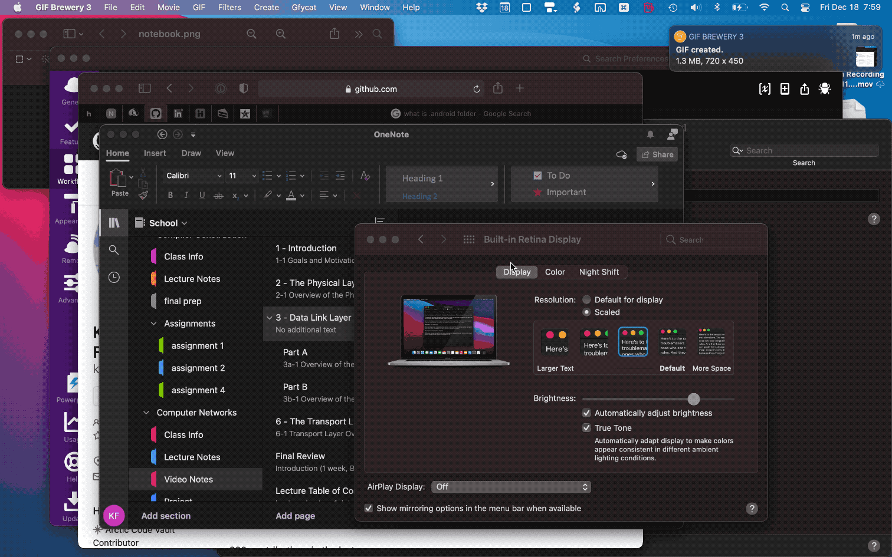

# Navigate OneNote Notebooks With Alfred

Search or browse any notebook,section group,section or page in Microsoft OneNote from [Alfred][alfredapp].
* * *

* * *
<!-- MarkdownTOC autolink="true" bracket="round" depth="3" autoanchor="true" -->

- [Navigate OneNote Notebooks With Alfred](#navigate-onenote-notebooks-with-alfred)
  - [Features](#features)
  - [Installation](#installation)
  - [Usage](#usage)
  - [Configuration](#configuration)
  - [Licensing & thanks](#licensing--thanks)
  - [Changelog](#changelog)

<!-- /MarkdownTOC -->

## Features

- Search or browse all OneNote Notebooks/section groups/sections/pages.
- **When searching**:
  - Press <kbd>↩︎</kbd> to either open the selected item in OneNote or browse the selection.
- **When browsing**:
  - Press <kbd>↩︎</kbd> to continue diving deeper into notebook hierarchy. Once a page is found (deepest depth) it will open it in OneNote
  - Press <kbd>⌘</kbd><kbd>↩︎</kbd> to open the currently selected notebook/section/section group

## Installation

Download [the latest release][gh-releases] and double-click the file to install in Alfred.

## Usage

The main keywords are `1a`, `1b`, `1r` & `1m`:

- `1a [<query>]` - Search all notebooks/section groups/sections/pages and retain memory for intelligent order.
  - <kbd>↩︎</kbd> or <kbd>⌘</kbd><kbd>NUM</kbd> — If the selection is a page (i.e. has no children), then open selection in OneNote; otherwise browse selection in Alfred.
  - <kbd>⌘</kbd><kbd>↩︎</kbd> — Open selection in OneNote instead of browse.

- `1b [<query>]` — Browse OneNote from top level Notebooks in Alfred.
  - <kbd>↩︎</kbd> or <kbd>⌘</kbd><kbd>NUM</kbd> — View the selections sub-sections, if it has no sub-sections (deepest level of notebook) it will open the page in OneNote.
  - <kbd>⌘</kbd><kbd>↩︎</kbd> — Open selection in OneNote instead.

- `1r [<query>]` — Search recent OneNote items.
  - <kbd>↩︎</kbd> or <kbd>⌘</kbd><kbd>NUM</kbd> — If the selection is a page (i.e. has no children), then open selection in OneNote; otherwise browse selection in Alfred.
  - <kbd>⌘</kbd><kbd>↩︎</kbd> — Open selection in OneNote instead of browse.

- `1m [<query>]` — Search recently modified OneNote items.
  - <kbd>↩︎</kbd> or <kbd>⌘</kbd><kbd>NUM</kbd> — If the selection is a page (i.e. has no children), then open selection in OneNote; otherwise browse selection in Alfred.
  - <kbd>⌘</kbd><kbd>↩︎</kbd> — Open selection in OneNote instead of browse.

- `1u` — Update stored OneNote data.

## Configuration

The workflow locates a database for each notebook stored and uses them to perform searches and build a URL that OneNote can respond to. The first search may be slower than expected but afterwards it should speed up.

  **_NOTE:_** Previous versions of this workflow did not get along with users whose notebooks were stored on Microsoft Sharepoint, I think this new version should work for it, but as mine are not stored on sharepoint, I can't test. If yours are stored on sharepoint and they still don't work, let me know.

## Licensing & thanks

This workflow is released under the [MIT Licence][mit].

This workflow uses on the wonderful library [alfred-workflow](https://github.com/deanishe/alfred-workflow) by [@deanishe](https://github.com/deanishe).

## Changelog

- v1.0.0 — 06/14/19
  - First public release
- v1.2.0 - 06/19/19
  - Fixed storage of base url
- v1.2.2 - 10/14/19
  - Added trap for sharepoint URLs
- v1.3.0 - 02/23/20
  - Added search all functionality
- v1.3.1 - 02/25/20
  - Added ability to browse a selection after searching all.
  - Improved code logic and added new keywords.
- v2.0.0 - 12/18/20
  - found databases which allowed to search/open every notebook item (including pages)
  - changed script altogether in order to adapt

[alfredapp]: https://www.alfredapp.com/
[gh-releases]: https://github.com/kevin-funderburg/alfred-microsoft-onenote-navigator/releases/latest
[mit]: https://raw.githubusercontent.com/kevin-funderburg/alfred-microsoft-onenote-navigator/master/LICENCE.txt
